# HITB SIN 2021 - SDR lab

- [HITB SIN 2021 - SDR lab](#hitb-sin-2021---sdr-lab)
  - [GNU Radio](#gnu-radio)
    - [Soapy RTLSDR Source](#soapy-rtlsdr-source)
    - [Osmocom source](#osmocom-source)
  - [GQRX](#gqrx)
  - [Airspy](#airspy)
  - [qspectrumanalyzer](#qspectrumanalyzer)
  - [Inspectrum](#inspectrum)
  - [URH](#urh)
    - [Signal to analyze](#signal-to-analyze)
  - [PentHertz Channel](#penthertz-channel)
  - [Virtual Machine](#virtual-machine)
  - [Videos](#videos)
  - [Distro](#distro)
  - [Other sources](#other-sources)
  - [Antena Size](#antena-size)
    - [Antenna Length Table](#antenna-length-table)

---





---

## GNU Radio



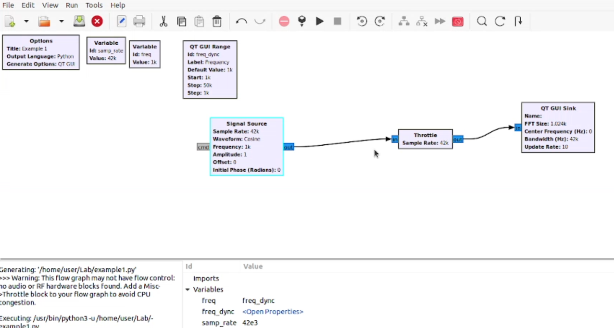

---

### Soapy RTLSDR Source

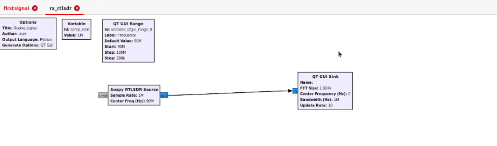

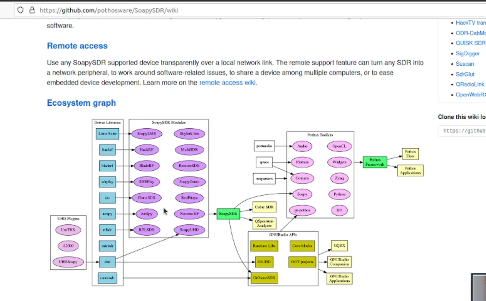

---

### Osmocom source

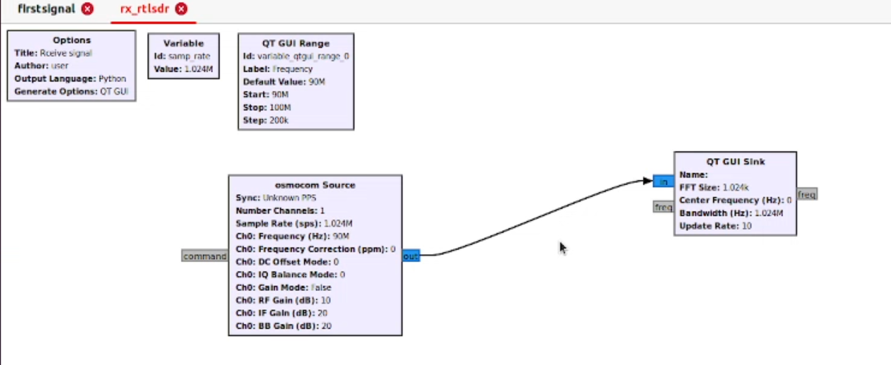

---

## GQRX



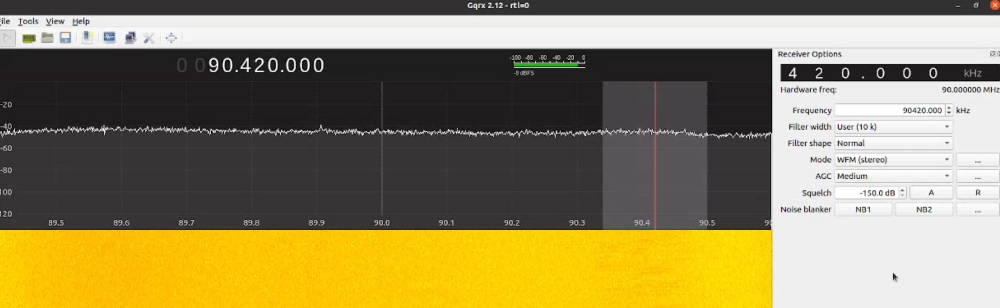

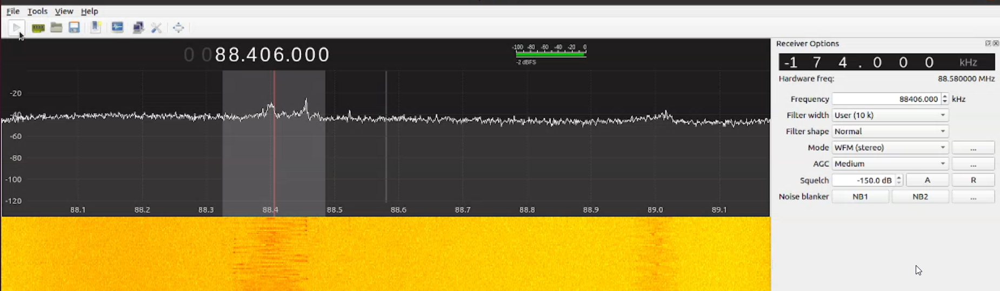

---

## Airspy



---

## qspectrumanalyzer



---

## Inspectrum



---

## URH







---

### Signal to analyze





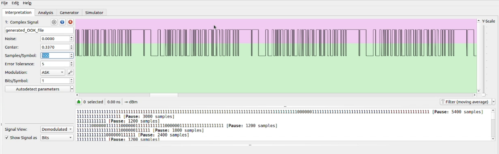

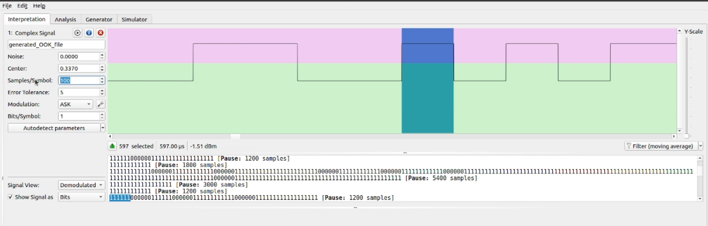

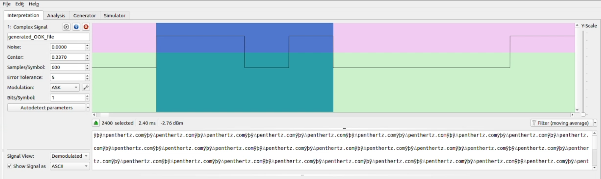

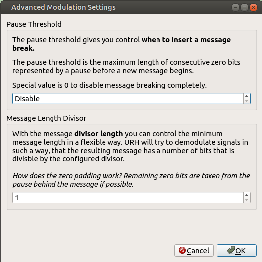

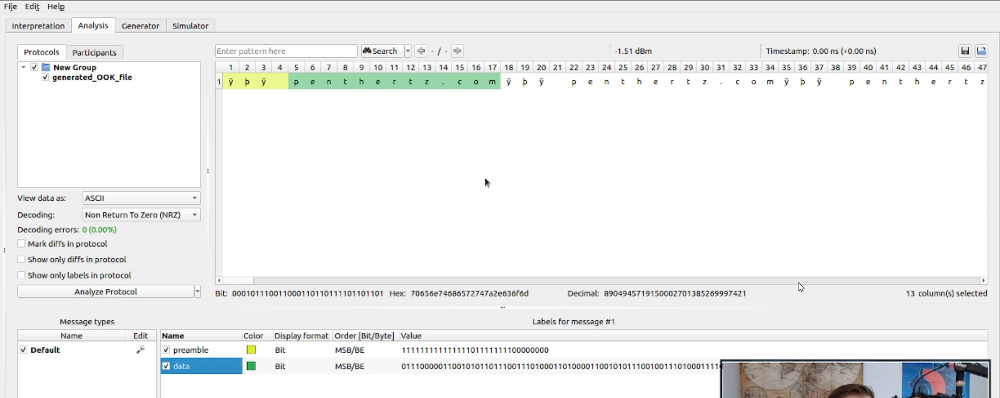

## PentHertz Channel



---

## Virtual Machine





---

## Videos







---

## Distro



---

## Other sources



---

## Antena Size



---

### Antenna Length Table

_**INFORMATION:**_ The table below has listed several common RF transmitter frequencies and their matching antenna length, the best antenna length is calculated by divide the wavelength by four.

| RF Module External Antenna Length Calculations |  |
| :--- | :--- |
| Operating Frequency | Best Antenna Length |
| 315 MHz | 23.81 cm / 9.37 inch |
| 418 MHz | 17.94 cm / 7.06 inch |
| 430 MHz | 17.44 cm / 6.87 inch |
| 433.92 MHz | 17.28 cm / 6.80 inch |
| 868.35 MHz | 8.64 cm / 3.40 inch |
