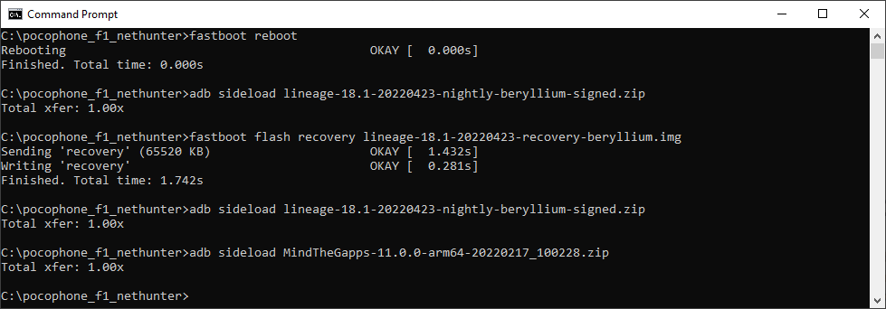
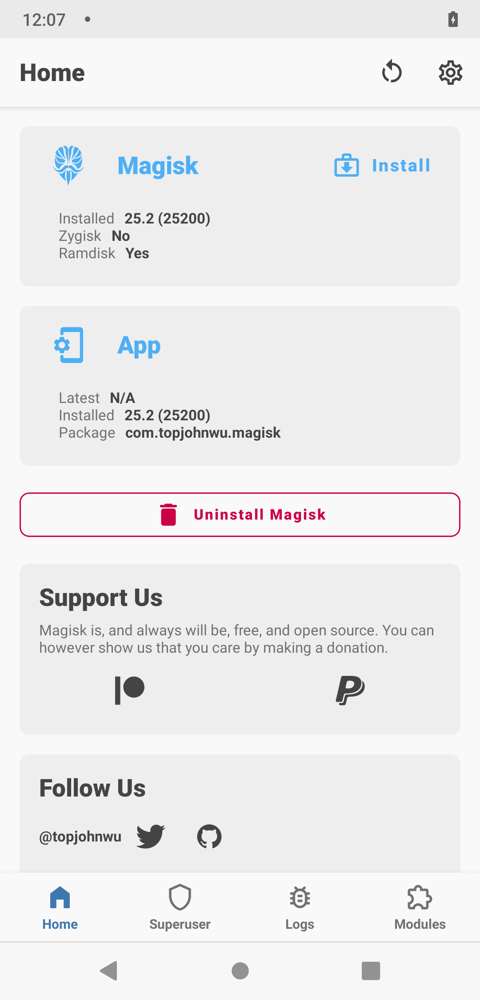

# Install Nethunter on Pocophone F1

- [Install Nethunter on Pocophone F1](#install-nethunter-on-pocophone-f1)
  - [Links](#links)
  - [Software](#software)
  - [Install Lineage OS](#install-lineage-os)
  - [Install Magisk](#install-magisk)
  - [Install NetHunter](#install-nethunter)

## Links

- [Wiki Pocophone F1](https://wiki.lineageos.org/devices/beryllium/)
- [Get Kali](https://www.kali.org/get-kali/#kali-mobile)
- [TWRP for Xiaomi Pocophone F1](https://twrp.me/xiaomi/xiaomipocophonef1.html)
- [Android Platfotm tpools](https://developer.android.com/studio/releases/platform-tools)
- [LineageOS ROM Xiaomi Poco F1 (beryllium)](https://lineageosroms.com/beryllium/)
- [Gapps](https://wiki.lineageos.org/gapps)
- [Installing Nethunter](https://www.kali.org/docs/nethunter/installing-nethunter/)
- [Magisk](https://forum.xda-developers.com/t/magisk-the-magic-mask-for-android.3473445/)
- [Magisk Install](https://topjohnwu.github.io/Magisk/install.html)
- [Magisk Github Releases](https://github.com/topjohnwu/Magisk/releases)

---

## Software

- Lineage OS 18.1 Recovery - <https://dl.lineageosroms.com/beryllium/lineage-18.1-20220423-recovery-beryllium.img>
- Lineage OS 18.1 - <https://dl.lineageosroms.com/beryllium/lineage-18.1-20220423-nightly-beryllium-signed.zip>
- GAPSS - <http://downloads.codefi.re/jdcteam/javelinanddart/gapps/MindTheGapps-11.0.0-arm64-20220217_100228.zip>
- Magisk - <https://github.com/topjohnwu/Magisk/releases/download/v25.2/Magisk-v25.2.apk>
- TWRP - <https://dl.twrp.me/twrpapp/me.twrp.twrpapp-26.apk.html>
- NetHunter - <https://kali.download/nethunter-images/kali-2022.3/nethunter-2022.3-beryllium-eleven-kalifs-full.zip>

---

## Install Lineage OS

- Start Pocophone in Fasboot mode.

  - Bootloader/Fastboot/Download: With the device powered off, hold Volume Down + Power. Keep holding both buttons until the word “FASTBOOT” appears on the screen, then release.

- `fastboot devices`
- `fastboot flash recovery lineage-18.1-20220423-recovery-beryllium.img`
- `fastboot reboot`
- Hold Volume Up + Power so that it boot into Recovery mode.
- Recovery Mode
  - `Factory Reset`
  - `Format data/ factory reset`
  - `Format data`
  - `Back`
  - `Apply update`
  - `Apply from ADB`
  - `adb sideload lineage-18.1-20220423-nightly-beryllium-signed.zip`
  - `adb sideload MindTheGapps-11.0.0-arm64-20220217_100228.zip`
  - `back`
  - `Reboot system now`

---

## Install Magisk

- Copy APK to device

- Run APK
- <https://topjohnwu.github.io/Magisk/install.html>

---

## Install NetHunter

- Start Pocophone in Fasboot mode.
- Install TWRP
- ``
